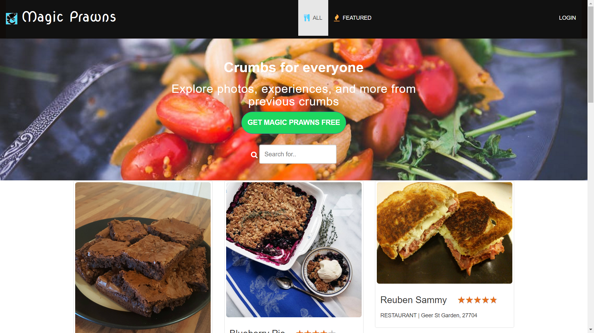
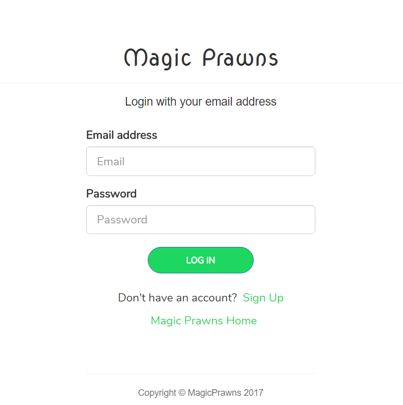

# Crumbs - Conquer the Entree Envy
 An application to help you recall that "great dish" you had at this restaurant. A personal repository of all the meals that tickled your taste buds!

## Screenshots




## Technologies used
- node.js
- Express
- Handblebars
- MySQL
- Sequelize

## Getting Started

These instructions will get you a copy of the project up and running on your local machine for development and testing purposes.

### Prerequisities

What to install and how for local development and testing purposes

```
- node.js: visit node.js and download...
- mysqldb: Got to https://www.mysql.com/ and install mysql, create database dishes_db in your local connection
- setup config.json to match your local mysqldb
- run: npm install --> to install all the dependencies
- 
```

## Built With

* Sublime Text


## Authors

* **Jincy George** - *Initial work* - [Jincy George](https://github.com)
* **James** - *Initial work* - [Jincy George](https://github.com)
* **Max** - *Initial work* - [Jincy George](https://github.com)
* **Guru** - *Initial work* - [Jincy George](https://github.com)


## License

This project is licensed under the MIT License - see the [LICENSE.md](LICENSE.md) file for details


